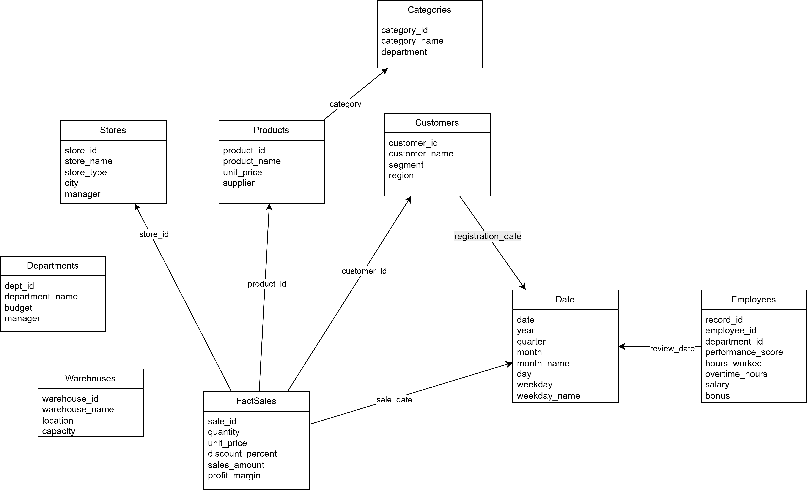

# 📊 HiloTools Data Pipeline

Pipeline de datos **end-to-end** desarrollado como parte de la prueba técnica de **HiloTools** (Convocatoria interna, agosto 2025).  
Integra información de **Ventas**, **RRHH** e **Inventarios** en un modelo analítico coherente, soportado en un esquema estrella y análisis PCA.

---

## 📁 Estructura del proyecto

```
.
├── ingest/             # Ingesta y limpieza de los Excel originales
├── model/              # Construcción del modelo en estrella
├── analytics/          # Análisis PCA y generación de figuras/tablas
├── report/             # Informe en LaTeX + figuras/tables exportadas
├── data/
│   ├── raw/            # Archivos originales (Excel)
│   ├── processed/      # Archivos transformados (parquet intermedios)
│   └── model/          # Tablas finales del esquema estrella
├── run_pipeline.sh     # Script que ejecuta todo el pipeline
├── Dockerfile          # Imagen para reproducibilidad
├── docker-compose.yml  # Orquestación de servicios
└── README.md           # Este documento
```

---

## 🚀 Instalación y ejecución en local

1. **Clonar el repositorio**
   ```bash
   git clone https://github.com/vcardonac1/Prueba-Hilo.git
   cd Prueba-Hilo
   ```

2. **Ejecutar el pipeline**
   ```bash
   bash run_pipeline.sh
   ```

---

## 🐳 Ejecución con Docker

1. **Construir imagen**
   ```bash
   docker build -t Prueba-Hilo .
   ```

2. **Ejecutar contenedor**
   ```bash
   docker run -it --rm -v $(pwd):/app Prueba-Hilo bash run_pipeline.sh
   ```

3. Los resultados estarán en:
   - `data/processed/`
   - `data/model/`
   - `analytics/outputs/`
   - `report/figures/`

---

## 📐 Modelo en estrella

El modelo estrella integra los tres dominios (Ventas, RRHH, Inventario) con una tabla de hechos principal (`FactSales`) y dimensiones:  
- Clientes  
- Productos  
- Tiendas  
- Fechas  
- Empleados  
- Departamentos  
- Almacenes  
- Categorías  

📌 Diagrama:  


---

## 🔬 Análisis PCA

Se construyeron *features* integrando métricas de ventas, desempeño de empleados y stock de inventarios.  
El análisis de componentes principales mostró que con **5 componentes** se captura casi el **80% de la varianza total**.  

Principales correlaciones:
- PC1: fuertemente asociado a `sales_amount` y `profit_margin`  
- PC3: influenciado por `discount_percent`  
- PC4: relacionado con `product_id`  

📌 Figuras generadas:
- `pca_variance.png`  
- `pca_loadings_heatmap.png`  

---

## 📄 Reporte

El informe técnico se encuentra en `report/`, desarrollado en **LaTeX**.  
Contiene:
- Introducción  
- Ingesta de datos  
- Modelo estrella  
- Análisis PCA  
- Conclusiones  

---

## ✅ Criterios cumplidos

- [x] Ingesta robusta (múltiples hojas, manejo de fechas, valores nulos, duplicados)  
- [x] Modelo estrella bien definido con tablas de hechos y dimensiones  
- [x] Análisis PCA con justificación de features y hallazgos  
- [x] Documentación clara, reproducibilidad (Conda/Docker) y reporte LaTeX  

---

👩‍💻 Autor: **Vhanessa Cardona**  
📅 Agosto 2025  
